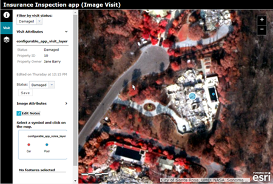

# Image Visit
Image Visit is a configurable app template that allows users to quickly review the attributes of a predetermined sequence of locations in imagery. The app optimizes workflows by loading the next image while the user is still viewing the current image, reducing the delay caused by waiting for the next image to be returned from the server. 

Check out an [example application](https://www.arcgis.com/apps/ImageVisit/index.html?appid=c092e2e099194c609350c0976540800f) built with the Image Visit template.

>There are three configurable app templates designed for imagery: [Imagery Viewer](https://github.com/Esri/imagery-viewer-template), [Image Mask](https://github.com/Esri/image-change-detection-template), and [Image Visit](https://github.com/Esri/image-visit-template/). Explore [example applications](http://arcgis.maps.arcgis.com/apps/MinimalGallery/index.html?appid=7207e9505d3e4cd4bf33e81c57190d1d) built with these templates. 

## Features
* The app uses a "Visit" layer (an editable hosted feature layer) or a web map's bookmarks to navigate through a predetermined sequence of locations.
* An optional "Notes" layer (a second editable hosted feature layer) can be used to add or edit features associated with the Visit locations.
* If you're using a Visit layer for navigation, an optional "Status" field can be selected that allows users to set the status of each Visit location as it's processed.
* A dialog window uses each layer's web map popup settings to display metadata about the Imagery, Visit, and Notes layers.
## Use Cases
Possible use cases include:
* __An insurance company checking properties.__ An insurance company has a set of properties to review after an event (e.g. a hurricane). The app would drive the user to each property, and allow the operator to record attributes (e.g. extent of damage).
* __Image analysts checking control points.__ Organizations that collect aerial photography often have a collection of marked or identifiable control points that they use to check their photographs. The app would drive the user to each of the known points, at a suitable scale, then allow the user to validate the location of the control point in the image to understand how the image relates to the ground. 
* __Checking automatically labeled features.__ In cases where AI is used for object identification, the app would drive the user to identified features to review/correct the classification.
## Supported Devices
* Apps created with this template are responsively designed for display on desktops, mobile phones, and tablets  using all [browsers supported by ArcGIS Online](http://doc.arcgis.com/en/arcgis-online/reference/browsers.htm).

## Instructions
1. To deploy this application, download the template repo and unzip it.
2. Copy the unzipped folder containing the web app template files, such as index.html, to your web server. You can rename the folder to change the URL through which users will access the application. By default the URL to the app will be `http://<Your Web Server>/<app folder name>/index.html`
3. Change the sharing host, found in defaults.js inside the config folder for the application, to the sharing URL for ArcGIS Online or Portal. For ArcGIS Online users, keep the default value of www.arcgis.com or specify the name of your organization.

	- ArcGIS Online Example:  `"sharinghost": location.protocol + "//" + <your organization name>.maps.arcgis.com`
	- Portal Example where `arcgis` is the name of the Web Adaptor: `"sharinghost": location.protocol + "//" + "webadaptor.domain.com/arcgis"`

4. If you are using Portal or a local install of the ArcGIS API for JavaScript, change all references to the ArcGIS API for JavaScript in index.html to refer to your local copy of the API. Search for the references containing `"//js.arcgis.com/3.24"` and replace this portion of the reference with the url to your local install.

	- For example: `"//webadaptor.domain.com/arcgis/jsapi/jsapi"` where `arcgis` is the name of your Web Adaptor.

5. Copy a group ID from Portal/ArcGIS Online and replace the default group ID in the application's default.js file. You can now run the application on your web server or configure the application further.

6. Read [instructions](https://doc.arcgis.com/en/arcgis-online/create-maps/create-app-templates.htm#ESRI_SECTION1_FBEEDC333D2A4765BA3F807B50AD558A) for making make the configurable template available through your organization.

> **Note:** If your application edits features in a feature service, contains secure services or web maps that aren't shared publicly, or generate requests that exceed 200 characters, you may need to set up and use a proxy page. Common situations where you may exceed the URL length are using complex polygons as input to a task or specifying a spatial reference using well-known text (WKT). For details on installing and configuring a proxy page see [Using the proxy](https://developers.arcgis.com/javascript/jshelp/ags_proxy.html). If you do not have an Internet connection, you will need to access and deploy the ArcGIS API for JavaScript documentation from [developers.arcgis.com](https://developers.arcgis.com/).

## Requirements
### Software
* ArcGIS Online subscription or ArcGIS Portal

### Data
* Creating an app with this template requires a web map with at least one imagery layer. 

## Resources
* Find more information about [Esri's configurable apps](http://www.esri.com/software/configurable-apps).
* [Esri's ArcGIS Online Help](http://resources.arcgis.com/en/help/arcgisonline/) describes how to create web maps and web map applications in the ArcGIS Online ecosystem.
* Check out the [GitHub repo for Web AppBuilder image services widgets](https://github.com/Esri/WAB-Image-Services-Widgets) for more information about building configurable imagery apps with ArcGIS.

## Issues
Find a bug or want to request a new feature?  Please let us know by submitting an issue.

## Contributing
Esri welcomes contributions from anyone and everyone. Please see our [guidelines for contributing](https://github.com/esri/contributing).

## Licensing
Copyright 2018 Esri

Licensed under the Apache License, Version 2.0 (the "License"); you may not use this file except in compliance with the License. You may obtain a copy of the License at 

http://www.apache.org/licenses/LICENSE-2.0. 

Unless required by applicable law or agreed to in writing, software distributed under the License is distributed on an "AS IS" BASIS, WITHOUT WARRANTIES OR CONDITIONS OF ANY KIND, either express or implied. See the License for the specific language governing permissions and limitations under the License.

A copy of the license is available in the repository's [license](LICENSE) file.

